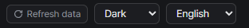

# Getting started
{: .no_toc }

1. TOC
{:toc}

---

## Requirements

- SPT server `~4.1.6`
- **No client plugin.** This is a server mod only, no BepInEx involved.

## Installation

1. Download `QuestCodex-<version>.zip` from [Releases](https://github.com/Viper-9/QuestCodex/releases).
2. Extract it and overwrite the resulting `SPT_Runtime` folder into your SPT install root (e.g. `C:\SPT`,
   the parent folder of the `SPT_Runtime` folder containing `SPT.Server.exe`).
3. Restart the server.

{: .note }
If your server root is the `SPT_Runtime` folder itself (older SPT layout), copy just the
`SPT_Runtime\user\mods\QuestCodex` folder from the zip into your server root's `user\mods\`.

## Opening it

Start the server, then open **`https://127.0.0.1:6969/questcodex`** in your browser.
You can also reach it from the mod card on the SPT server web page (`https://127.0.0.1:6969`).

- If you get a certificate warning, proceed. It's the same self-signed certificate the SPT server web page uses.
- The SPT server binds to `127.0.0.1` only, so the page opens **only in a browser on the machine running
  the server**. Phones and other PCs cannot reach it.
- You can keep it open on a second monitor while playing. It's read-only and doesn't touch the game.

## Language and theme

- **Language**: `English` / `한국어` / `Русский`. UI strings and quest/item names change together
  (game text comes from the server's locale tables).
- **Theme**: `System` / `Light` / `Dark`, remembered in the browser.

## Refresh data

Map and loot data are built once per server run and kept on disk, so later starts are fast. If you change mod
settings that affect loot (such as a loot preset) without changing the mod list, press **Refresh data** at the right
of the top bar to rebuild it. It takes about 10 seconds.

## Side menu

The menu button at the left of the top bar hides or shows the side menu, and the choice is remembered.
