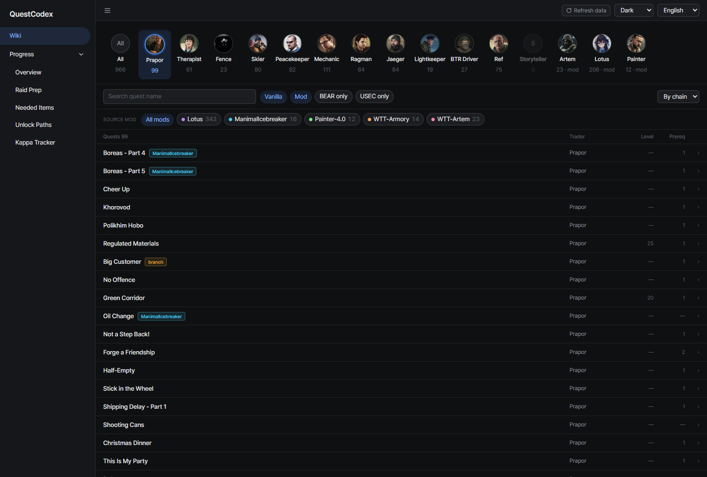

# QuestCodex

A browser-based quest wiki for **the quests actually loaded on your own SPT server**.
{: .fs-6 }

[Get started](getting-started.html){: .btn .btn-primary .mr-2 }
[Download](https://github.com/Viper-9/QuestCodex/releases){: .btn }

---

External wiki sites track live EFT, which is not what your server runs. QuestCodex reads the quest tables
your server holds in memory and builds the catalog from those. If a quest mod changed a condition or a
reward, you see the changed value, and quests a mod added show up in the same list as the vanilla ones,
tagged with the mod they came from.

It only **reads** server data. It never modifies quests, profiles or traders.

## What's inside

| Page | What it does |
|:-----|:-------------|
| [Wiki](wiki/) | Every quest on your server, with filters, chains, rewards and mod attribution |
| [Quest guide](wiki/quest-guide.html) | What to bring before a raid: maps, weapons, gear, items to hand over or plant |
| [Progress](progress/) | Your profile's quest progress, raid prep per map, the items you still need, the quests that unlock items and your way to Kappa |
