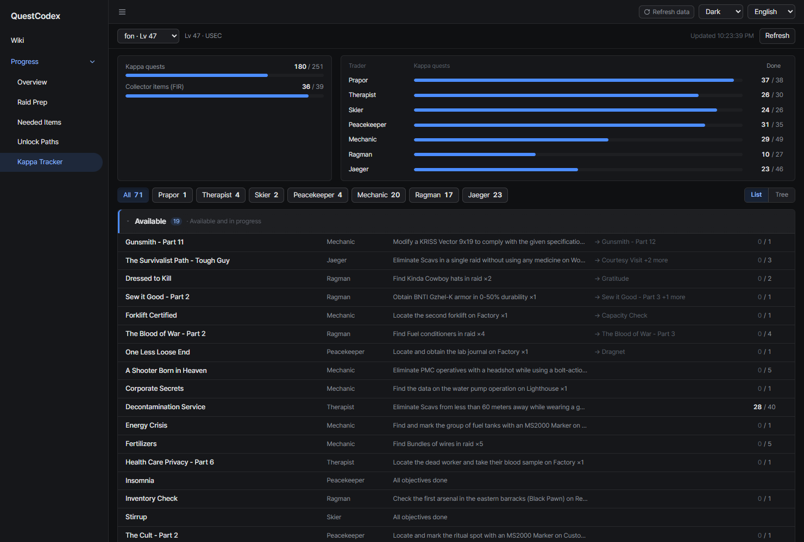
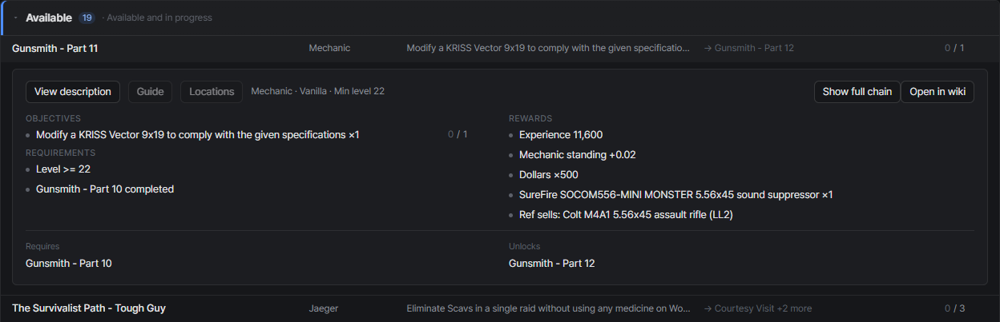
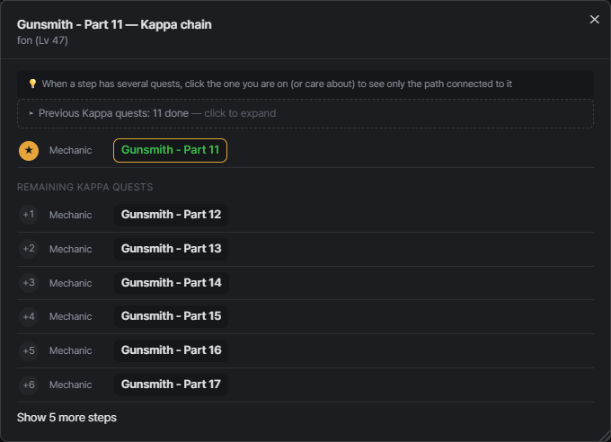
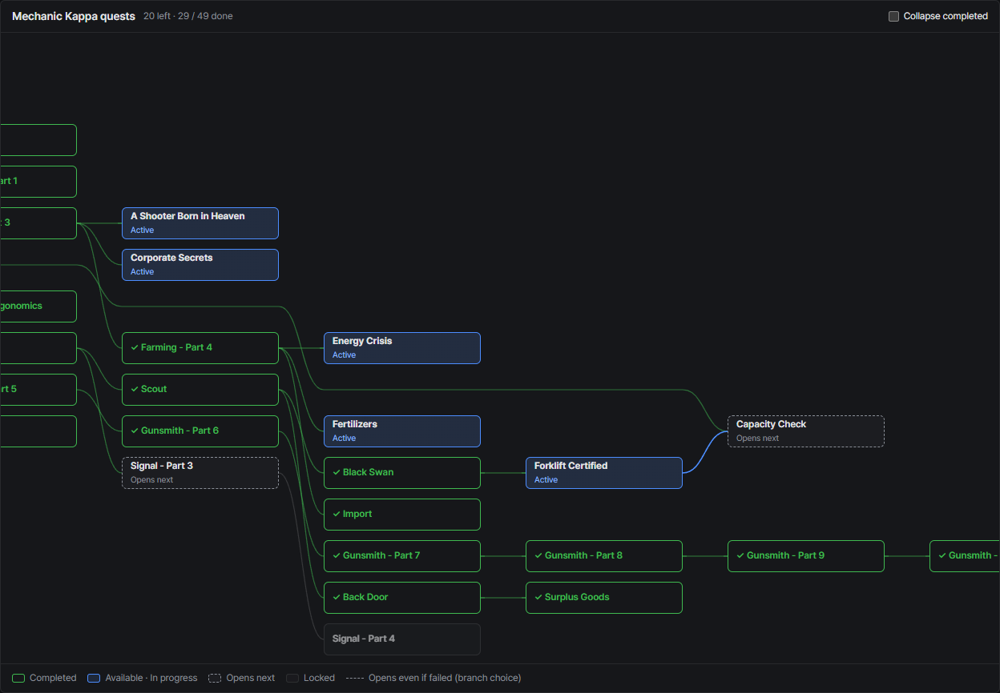
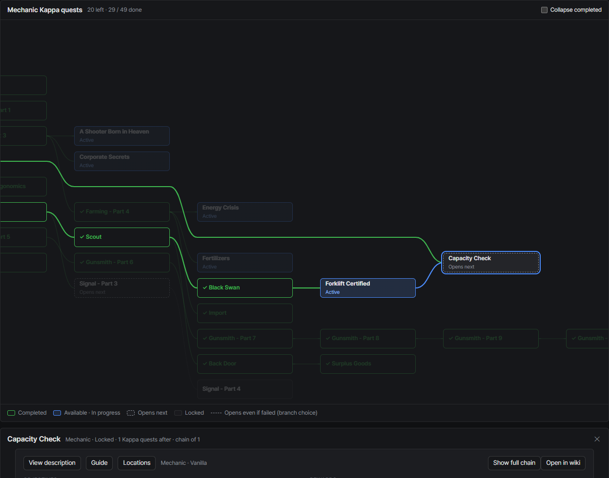
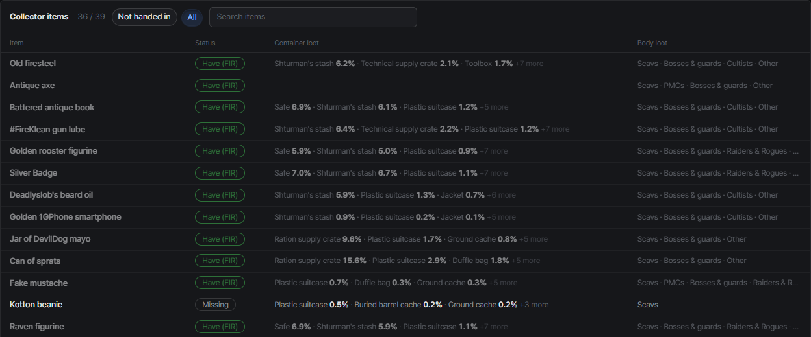

# Kappa tracker
{: .no_toc }

What's left before the Collector quest and the Kappa container, and which Kappa quests to work on next.

1. TOC
{:toc}

---

## What counts toward Kappa

The list isn't fixed. QuestCodex reads the Collector quest on your server and counts the quests it requires, plus
every quest before them. Vanilla servers get the quest list as is, and quest mods that change the Collector
requirements (for example by adding trader loyalty levels or a player level) are followed too.

Failed quests count as done when every later quest also accepts the failure, as with branch choices.

## Summary

- The left card has one bar per kind of requirement: **Kappa quests**, **Collector items (FIR)**, and **Level** or
  **Trader levels** when the Collector quest asks for them
- The right card shows Kappa quests done per trader. When the Collector quest asks for trader levels, a **Required**
  column shows them too

## Quest list

The trader tabs above the list show how many Kappa quests each trader has left. Pick one to see only theirs.

- **Available**: quests you can accept or have in progress, longest remaining chain first. The right side names the
  Kappa quest that finishing this one unlocks, with `+N more` when there are several
- **Locked**: quests you can't take yet, the closest to opening first. Folded by default
- **Done**: finished Kappa quests, the latest first. Folded by default

Click a row to see its objectives, requirements and rewards, the same detail as in the overview.

{: .note }
A profile that has never entered the game has every quest locked. The list then explains why and names the quests
that open first.

## Quest flow

**Show full chain** opens the Kappa quests before and after one quest. The quest you picked is in the middle with a
star, the Kappa quests you already finished above it are folded into one line, and the remaining ones follow step by
step below. Long chains show the first steps with **Show N more steps**.

For **Gunsmith - Part 11**, for example, the 11 Kappa quests before it are folded as done, and the 11 parts left up to Part 22 follow below.

When a step has several quests, click the one you're on to keep only the quests connected to it, as in
[Unlock paths](unlock-paths.html).

## Tree view

Pick a trader tab and switch **List** to **Tree** to see that trader's Kappa quests as a tree. Each column is one
step further down the prerequisites, and lines connect a quest to the quests it unlocks. The view you pick is
remembered.

- Colors show **Completed**, **Available · In progress**, **Opens next** (every prerequisite is done or in
  progress) and **Locked**. A dashed line marks a quest that opens even if the branch quest before it failed
- A quest from another trader that one of these needs is drawn as a faint dotted box, one step back
- **Collapse completed** folds the finished quests into one box
- Drag with the mouse to move around a large tree

Click a quest to highlight the quests it needs and the quests that need it. Its detail opens under the tree, with
**Show full chain** and **Open in wiki**.

## Collector items

The items the Collector quest asks you to hand over, with where to find them.

- **Status**: **Handed over**, **Have (FIR)**, **not FIR** (you have one that isn't found in raid) or **Missing**
- **Container loot**: the containers the item most often spawns in, with the chance it's inside when you open one.
  Hover for the full list
- **Body loot**: the kinds of bots that can carry it
- **Not handed in** / **All** and the search box narrow the table

