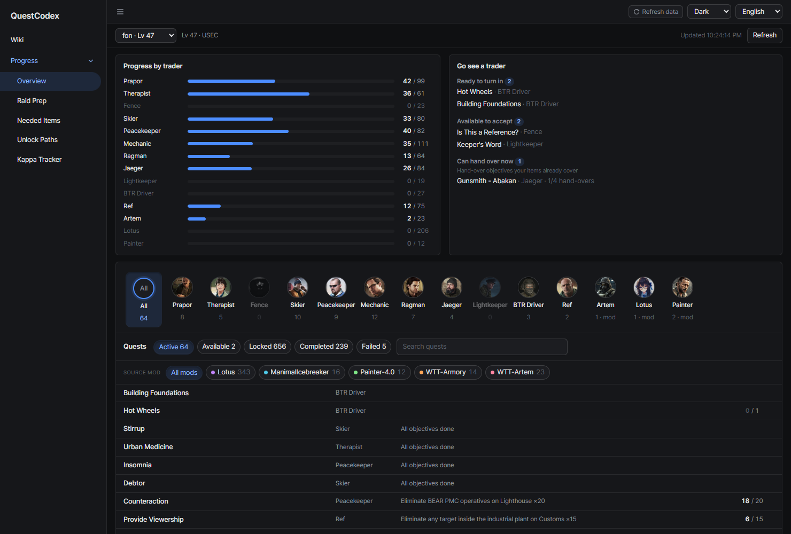
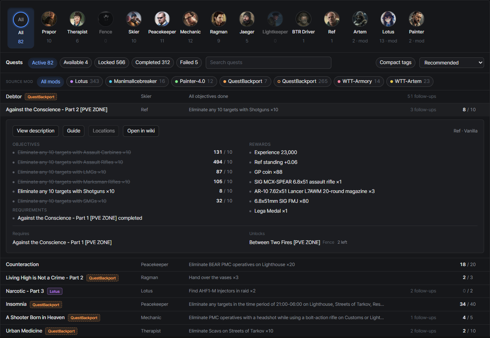

# Overview
{: .no_toc }

1. TOC
{:toc}

---

## Trader progress

A progress bar per trader with finished and total quest counts. Traders you've fully finished turn green.

## What you can do now

Under **Go see a trader**:

- **Ready to turn in**: every objective is done
- **Available to accept**: quests you can pick up now
- **Can hand over now**: hand-over objectives your items already cover

## Quests by status

All quests grouped by status, with search and the same trader row as the wiki. Mod quests carry their mod name tag.
The same [source mod filter](../wiki/quest-list.html#mod-filter) sits under the status tabs, and the tab
counts and trader row follow the mods you pick.

Click a quest to expand the same details as the wiki (description, guide, locations map, branch warning,
rewards, related quests), plus your progress:

- Objectives show their counters, and finished ones are struck through
- Locked quests mark the start conditions you haven't met yet, with your current value
- **Open in wiki** jumps to the quest in the wiki; related quest links jump within this list
- Each quest under **Unlocks** shows how many follow-ups it still has left

Each tab sorts for what you'd look for first:

- **Active**: ready to turn in first, then by objective completion
- **Locked**: closest to unlocking first
- **Completed / Failed**: most recent first

Quests you can never finish on this profile (other faction only, or a branch you already closed) are
marked **Unreachable**.

### Follow-ups and sorting

Each row shows **N follow-ups**: how many quests that quest eventually leads to and you haven't finished yet.
It follows unlocks all the way down and counts a shared branch only once. Quests at the end of a chain show nothing.

The sort menu next to the search box picks the order:

- **Recommended** (default): the per-tab order above
- **Most follow-ups left**: quests that open up the most first
- **Fewest follow-ups left**
