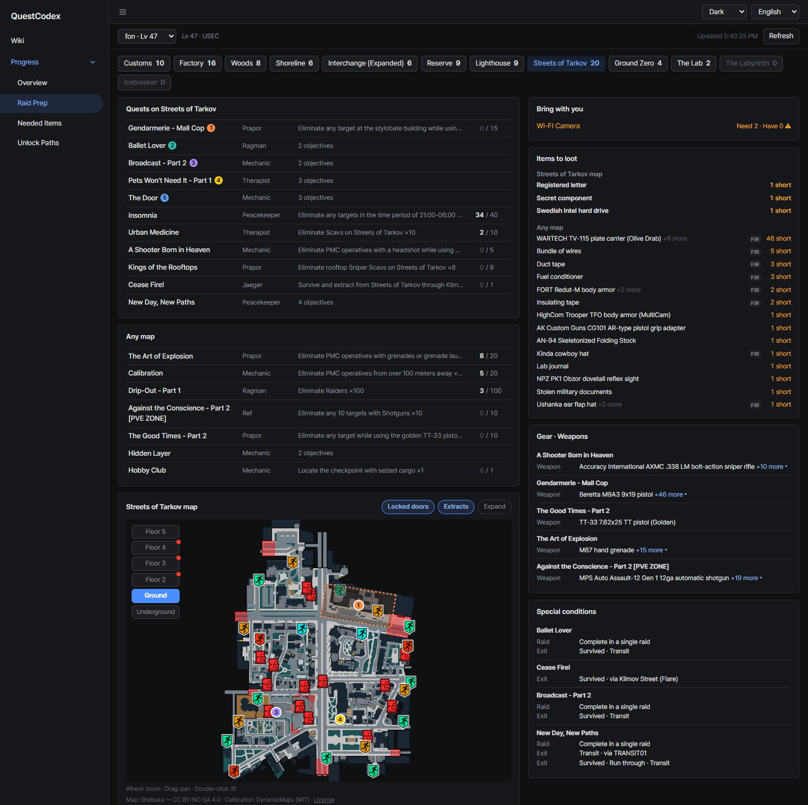
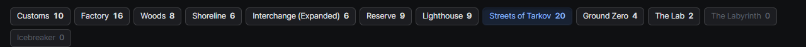
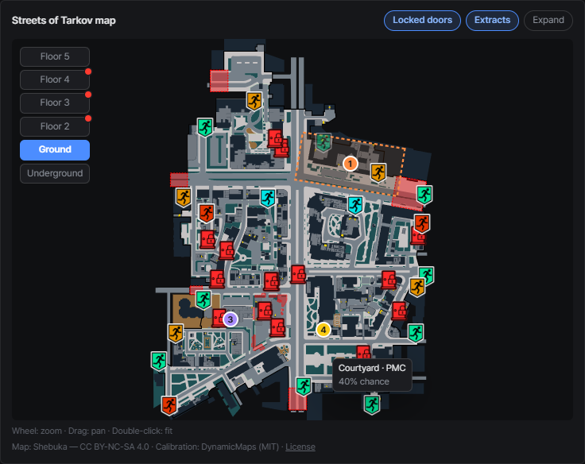
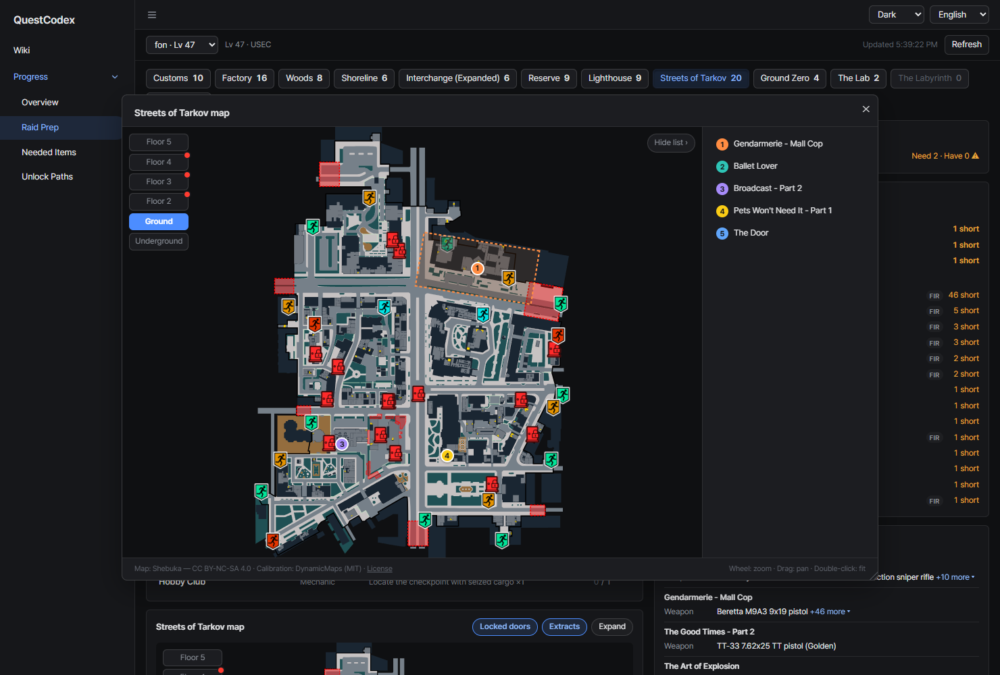

# Raid prep
{: .no_toc }

Pick the map you're about to play and see everything your active quests want there.

1. TOC
{:toc}

---

## Map tabs

Each map tab shows how many open objectives it has. A map your server has gets a tab even with no quests on
it yet, such as the Icebreaker, so you can still check its extracts and locked doors.

## Quests on this map

Quests with objectives on the selected map, plus objectives you can do on any map, grouped per quest.
Expanding a quest dims the objectives that belong to other maps.

Quests drawn on the map come first, then quests with counters by progress, then the rest by name.

## Map

Under the quest lists sits a map card that follows the selected map tab and stays in view while you scroll.
It's the same map as the wiki's [quest locations map](../wiki/quest-details.html#quest-locations-map),
with all the quests on this map at once.

- Quest rows carry the same colored number as their markers. Hover either side to highlight the other
- Floor buttons, objective areas and the **Locked doors** toggle work like in the wiki. Lock icons near a
  marker tell you which key you may want to bring
- **Extracts** shows the map's extracts and transits. Hover one to check its requirement and spawn chance
  before you plan your way out

**Expand** opens the map in a movable, resizable window with a numbered quest list. The page behind it
stays scrollable and clickable. Close it with the close button or `Esc`.

## Bring with you / Items to loot

- **Bring with you**: items to plant on this map, with how many you need and how many you have
- **Items to loot**: items your quests want you to find on this map

## Gear and special conditions

- **Gear · Weapons**: required or banned gear and allowed weapons, grouped per quest
- **Special conditions**: rules like completing in a single raid or using a specific exit

{: .note }
Objectives without map data take the map named in their text, and are marked as inferred.
