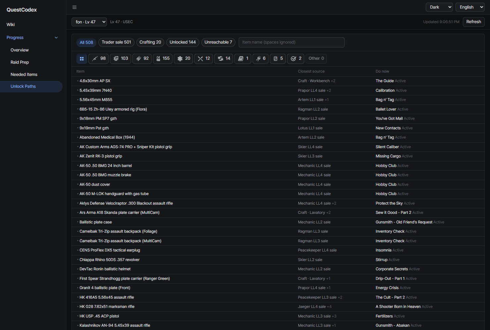
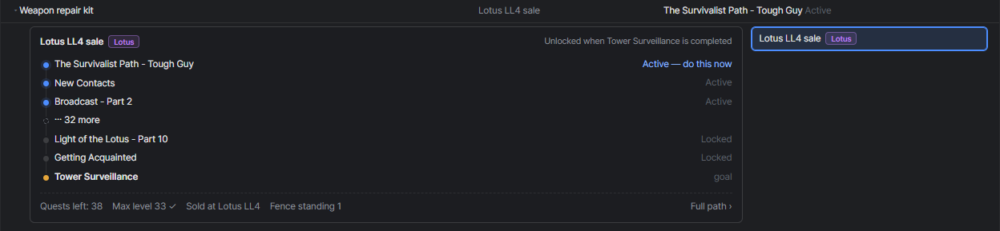
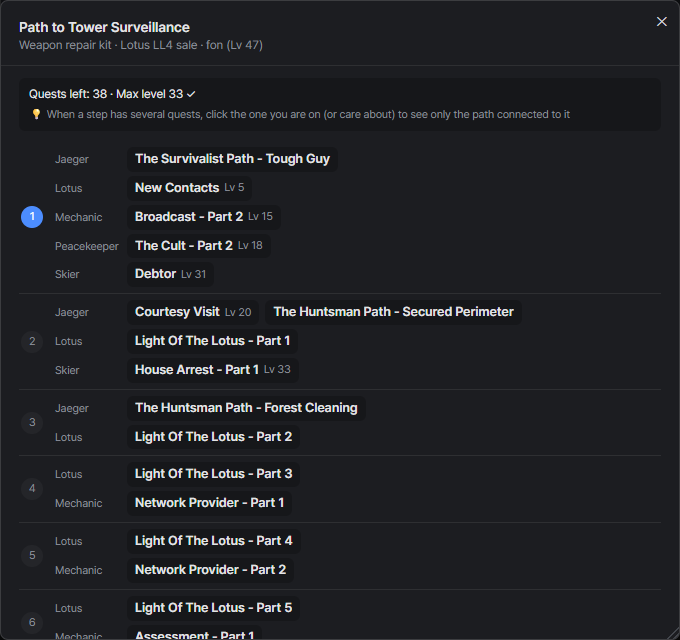
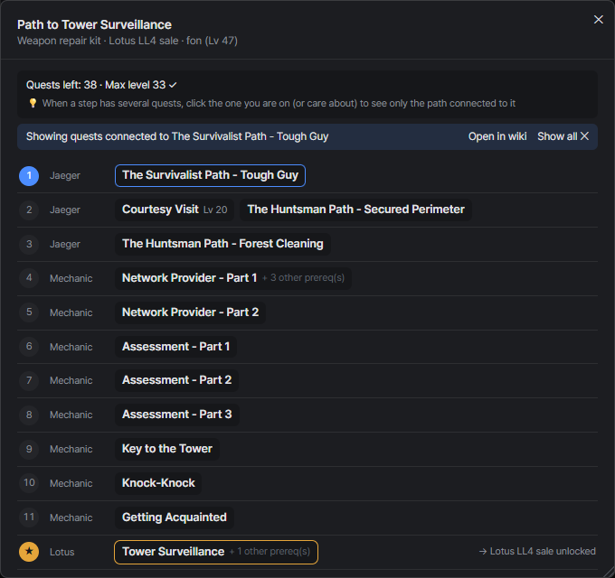

# Unlock paths
{: .no_toc }

Items that a quest unlocks for sale at a trader or as a craft, and the quests you still have to finish to get there.

1. TOC
{:toc}

---

## The list

Each row is one item, sorted by how many quests are left before you can get it.

- **Closest source**: the trader sale or craft that takes the fewest quests, with `+N` when there are more
- **Do now**: the quest to work on next, or what's blocking it (a level or a quest status you need first)

Use the chips (**All**, **Trader sale**, **Crafting**, **Unlocked**, **Unreachable**), the category icon row and
the search box to narrow the list. Search ignores spaces.

{: .note }
One-time quest rewards and items a trader sells at a loyalty level alone aren't listed. They don't need a quest
path.

## Closest path

Click a row to see the path for its closest source. The card lists the quests in order, from what you can do now
to the goal quest, and long paths fold in the middle. The bottom line sums up the quests left, the highest level
required on the way and any trader loyalty or standing the quests ask for.

When an item has several sources, the list on the right switches between them.

## Full path

**Full path ›** opens every quest on the path, step by step. Quests in the same step can be done in any order,
and each step groups them by trader. Quests above your level and branch quests that would fail another quest are
marked. Drag the window's edges to resize it.

## Focusing on one quest

Some paths branch out a lot. Searching `kit` and opening **Weapon repair kit** on a level 47 profile, for example,
gives 38 quests across many traders, which is hard to follow at once.

Click the quest you're on, such as **The Survivalist Path - Tough Guy**, and the window keeps only the quests
connected to it: the quests it needs and the quests that need it, down to the goal. The result is one short route
you can follow from start to end.

- **+ N other prereq(s)** marks a quest that also needs quests from other branches, which are hidden while focusing
- **Open in wiki** opens the focused quest in the wiki, and **Show all** goes back to the full path

## Unreachable sources

A source is marked unreachable when its path goes through a quest you can no longer finish on this profile:

- A quest you failed
- The other side of an exclusive branch you already took
- A quest for the other faction only
- A quest the server keeps locked (events and the like)
