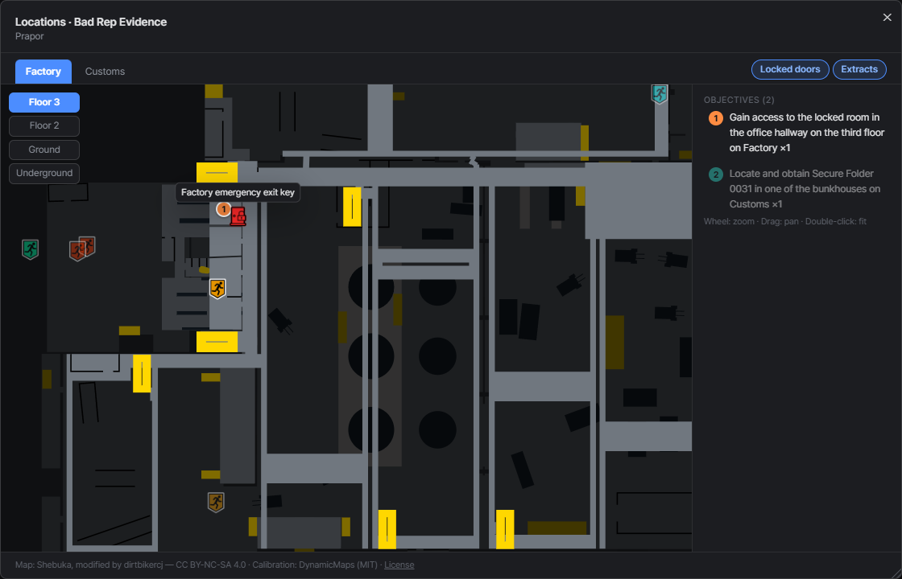
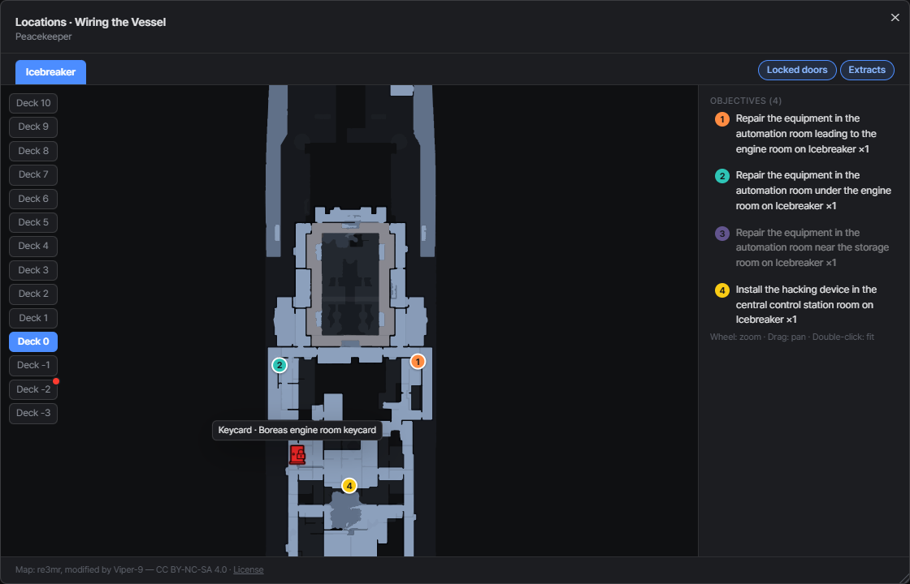
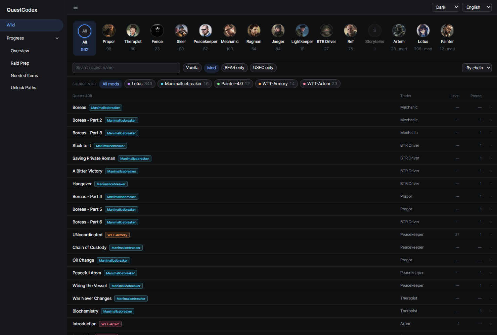

# Quest details
{: .no_toc }

1. TOC
{:toc}

---

## Inline expansion

Click a quest row and it expands in place with objectives, requirements, rewards (including on-accept and
on-fail rewards) and its prerequisite and unlock links. Several rows can stay open at once.

## Chain jumps

Click a prerequisite or unlocked quest name in the expanded row to jump straight to it.

## Description popup

The full quest description opens in a popup, so long text doesn't stretch the list.

## Quest locations map

The **Locations** button next to the guide button opens a map of where the quest's objectives are. It's greyed
out when no objective has location data.

- Each objective gets a numbered marker; kill-zone and flare objectives are drawn as areas, one color per objective
- Map tabs switch maps, and floor buttons switch floors. A red dot on a floor button means that floor has objectives too
- Wheel to zoom, drag to pan, double-click to fit
- **Locked doors** shows lock icons for locked doors and keycard doors. Hover one to see the key it needs
- **Extracts** shows extracts and transits as shield icons, colored for PMC, shared and scav extracts.
  Hover one to see its name and side, plus its requirement (e.g. a fee or climbing gear) and spawn chance
  when it has them. Extracts on other floors are drawn dimmed

QuestCodex doesn't know which quests need a key, but the map gets you most of the way: if a marker sits
next to a lock icon, hover it to see which key opens that door, and you can judge for yourself whether to
bring it.

### Icebreaker

The Icebreaker map is ready ahead of SPT v5. Until then, it shows up as soon as your server has the
Icebreaker location, for example from a mod that adds it.

- Floors are the ship's decks (`Deck -3` to `Deck 10`)
- Besides key and keycard doors, the door tooltip covers keypad doors (with the code when it's fixed),
  doors you blow open with an explosive charge and frozen hatches you melt with a gas torch
- Repair objectives that point at a switch, like the breaker panels in Wiring the Vessel, get markers too

### Expanded Interchange

If a mod that expands Interchange is loaded, the map and its quest zones, areas and locked doors switch to
the expanded version, and the tab reads **Interchange (Expanded)**. Without it, nothing changes.

## Branch warnings

Some quests sit on mutually exclusive branches: finishing one fails or locks the other.
These quests carry a branch tag in the list, and the details warn you which quests you would lock out.

## Mod attribution

Quests from mods carry their source mod's name, color-coded per mod.

{: .note }
Quests a mod injects from C# code rather than from JSON files leave no file trace, so their source mod
can't be identified. Those get a generic `mod` label instead.
