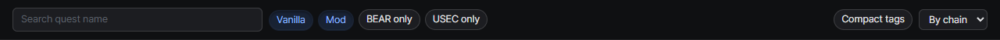
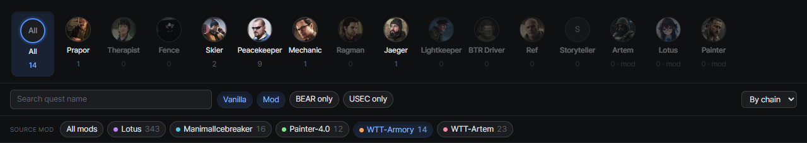

# Quest list
{: .no_toc }

1. TOC
{:toc}

---

## Trader filter

Pick a trader from the avatar row to see only their quests. Mod-added traders are listed too.

## Search and filter chips

Search by quest name, and narrow the list with the `Vanilla` / `Mod` and `BEAR only` / `USEC only` chips.

## Mod filter

When your server has mod quests and the `Mod` chip is on, a **Source mod** row appears under the filter bar.
Mods often add quests to vanilla traders, so this is the quickest way to see everything one mod added.

- Pick one or more mods. **All mods** clears the selection
- It combines with the trader filter, and the trader row recounts for the selected mods
- Chip dots use the same colors as the mod tags in the list

## Vanilla quests a mod overrides

Some quest mods replace the files of vanilla quests instead of adding new ones. Those quests stay vanilla, but they
carry the mod's name in a tag with a dashed outline, in the wiki and on the progress pages.

- The mod gets its own chip in the **Source mod** row, with a hollow dot, so you can list every quest it overrides
- The expanded quest's meta line reads **Overridden by** and the mod name

## Sorting

- **By chain** (default): prerequisites always sit above the quests they unlock
- **By level**
- **By name**

## Deep links

`?quest=<questId>` opens a specific quest directly, so you can bookmark or share a quest.
